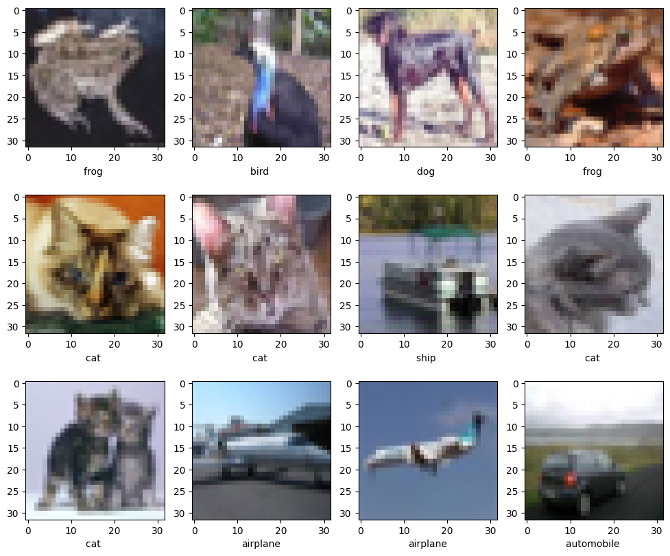

# Домашнее задание. Свёрточные сети

Здесь вам предстоит построить и обучить свою первую свёрточную сеть для классификации изображений на данных CIFAR10.


```python
import tensorflow as tf

from tqdm import tqdm_notebook
```

## Данные

CIFAR10
* 60000 RGB изображений размером 32x32x3
* 10 классов: самолёты, собаки, рыбы и т.п.


Загрузите данные, разделите их на обучающую и тестовую выборки. Размер тестовой выборки должен быть $10^4$.


```python
import numpy as np
from keras.datasets import cifar10
from sklearn.model_selection import train_test_split
(X_train, y_train), (X_test, y_test) = cifar10.load_data()
X_train, X_val, y_train, y_val = train_test_split(X_train, y_train, test_size=10**4, random_state=42)

class_names = np.array(['airplane','automobile ','bird ','cat ','deer ','dog ','frog ','horse ','ship ','truck'])

print (X_train.shape,y_train.shape)
```

    (40000, 32, 32, 3) (40000, 1)


Прежде чем приступать к основной работе, стоит убедиться что загруженно именно то, что требовалось:


```python
import matplotlib.pyplot as plt
%matplotlib inline

plt.figure(figsize=[12,10])
for i in range(12):
    plt.subplot(3, 4, i + 1)
    plt.xlabel(class_names[y_train[i, 0]])
    plt.imshow(X_train[i])
```


    

    


## Подготовка данных

Сейчас каждый пиксель изображения закодирован тройкой чисел (RGB) __от 0 до 255__. Однако лучше себя показывает подход, где значения входов нейросети распределены недалеко от 0.

Давайте приведём все данные в диапазон __`[0, 1]`__ — просто разделим на соответствующий коэффициент:


```python
X_train = X_train / 255
X_val = X_val / 255
X_test = X_test / 255
```

Исполните код ниже для проверки, что все выполнено корректно.


```python
assert np.shape(X_train) == (40000, 32, 32, 3), "data shape should not change"
assert 0.9 <= max(map(np.max, (X_train, X_val, X_test))) <= 1.05
assert 0.0 <= min(map(np.min, (X_train, X_val, X_test))) <= 0.1
assert len(np.unique(X_test / 255.)) > 10, "make sure you casted data to float type"
```

## Архитектура сети

Для начала реализуйте простую нейросеть:
1. принимает на вход картинки размера 32 x 32 x 3;
2. вытягивает их в вектор (`keras.layers.Flatten`);
3. пропускает через 1 или 2 полносвязных слоя;
4. выходной слой отдает вероятности принадлежности к каждому из 10 классов.

Создайте полносвязную сеть:


```python
import keras
from keras import layers as L
from keras import backend as K
```


```python
model = tf.keras.models.Sequential([
        tf.keras.layers.Dense(64, activation='relu', input_shape=(X_train.shape[1:])),
        tf.keras.layers.Flatten(),
        tf.keras.layers.Dense(128, activation='relu'),
        tf.keras.layers.Dense(256, activation='relu'),
        tf.keras.layers.Dense(10, activation='softmax')
])
```


```python
X_train[:20].shape
```


    (20, 32, 32, 3)


```python
dummy_pred = model.predict(X_train[:20])
assert dummy_pred.shape == (20, 10)
assert np.allclose(dummy_pred.sum(-1), 1)
print("Успех!")
```

    1/1 [==============================] - 0s 79ms/step
    Успех!


## Обучение сети

**Задание 1.1 (обязательно)** Будем минимизировать многоклассовую кроссэкнропию с помощью __sgd__. Вам нужно получить сеть, которая достигнет __не менее 45%__ __accuracy__ на тестовых данных.

__Важно:__ поскольку в y_train лежат номера классов, Керасу нужно либо указать sparse функции потерь и метрики оценки качества классификации (`sparse_categorical_crossentropy` и `sparse_categorical_accuracy`), либо конвертировать метки в one-hot формат.

### Полезные советы
* `model.compile` позволяет указать, какие метрики вы хотите вычислять.
* В `model.fit` можно передать валидационную выборку (`validation_data=[X_val, y_val]`), для отслеживания прогресса на ней. Также рекомендуем сохранять результаты в [tensorboard](https://keras.io/callbacks/#tensorboard) или [wandb](https://docs.wandb.ai/integrations/jupyter). **Важно: логи tensorboard не получится без боли посмотреть через colab.** Workaround: скачать логи и запустить tensorboard локально или помучаться [с этим](https://stackoverflow.com/questions/47818822/can-i-use-tensorboard-with-google-colab).
* По умолчанию сеть учится 1 эпоху. Совсем не факт, что вам этого хватит. Число эпох можно настроить в методе `fit` (`epochs`).
* Ещё у Кераса есть много [полезных callback-ов](https://keras.io/callbacks/), которые можно попробовать. Например, автоматическая остановка или подбор скорости обучения.


```python
y_train, y_val = (keras.utils.to_categorical(y) for y in (y_train, y_val))
```


```python
callbacks = [tf.keras.callbacks.ModelCheckpoint(filepath='model.{epoch:02d}-{val_loss:.2f}.h5'),
             tf.keras.callbacks.TensorBoard(log_dir='./logs'),
             tf.keras.callbacks.EarlyStopping(patience=3)]
```


```python
## TODO

optimizer = tf.keras.optimizers.SGD(
    learning_rate=0.001,
    momentum=0.9,
    nesterov=True
)
model.compile(
    optimizer=optimizer,
    loss='categorical_crossentropy',
    metrics=['accuracy']
)
model.fit(X_train, y_train, batch_size=16, epochs=32, callbacks=callbacks, validation_split=0.2)
```

    Epoch 1/32
    2000/2000 [==============================] - 9s 4ms/step - loss: 1.8589 - accuracy: 0.3349 - val_loss: 1.7101 - val_accuracy: 0.3959
    Epoch 2/32
    2000/2000 [==============================] - 8s 4ms/step - loss: 1.6087 - accuracy: 0.4272 - val_loss: 1.5755 - val_accuracy: 0.4385
    Epoch 3/32
    2000/2000 [==============================] - 8s 4ms/step - loss: 1.5000 - accuracy: 0.4646 - val_loss: 1.4827 - val_accuracy: 0.4678
    Epoch 4/32
    2000/2000 [==============================] - 8s 4ms/step - loss: 1.4196 - accuracy: 0.4961 - val_loss: 1.4535 - val_accuracy: 0.4815
    Epoch 5/32
    2000/2000 [==============================] - 8s 4ms/step - loss: 1.3498 - accuracy: 0.5188 - val_loss: 1.4074 - val_accuracy: 0.5008
    Epoch 6/32
    2000/2000 [==============================] - 8s 4ms/step - loss: 1.2859 - accuracy: 0.5453 - val_loss: 1.3743 - val_accuracy: 0.5156
    Epoch 7/32
    2000/2000 [==============================] - 8s 4ms/step - loss: 1.2280 - accuracy: 0.5646 - val_loss: 1.3510 - val_accuracy: 0.5222
    Epoch 8/32
    2000/2000 [==============================] - 8s 4ms/step - loss: 1.1757 - accuracy: 0.5857 - val_loss: 1.3505 - val_accuracy: 0.5205
    Epoch 9/32
    2000/2000 [==============================] - 8s 4ms/step - loss: 1.1200 - accuracy: 0.6049 - val_loss: 1.3441 - val_accuracy: 0.5235
    Epoch 10/32
    2000/2000 [==============================] - 8s 4ms/step - loss: 1.0677 - accuracy: 0.6254 - val_loss: 1.3126 - val_accuracy: 0.5462
    Epoch 11/32
    2000/2000 [==============================] - 8s 4ms/step - loss: 1.0141 - accuracy: 0.6422 - val_loss: 1.3538 - val_accuracy: 0.5346
    Epoch 12/32
    2000/2000 [==============================] - 8s 4ms/step - loss: 0.9640 - accuracy: 0.6594 - val_loss: 1.3451 - val_accuracy: 0.5409
    Epoch 13/32
    2000/2000 [==============================] - 8s 4ms/step - loss: 0.9112 - accuracy: 0.6773 - val_loss: 1.3742 - val_accuracy: 0.5421


    <keras.callbacks.History at 0x7f01adf9b8b0>


А теперь можно проверить качество вашей сети, выполнив код ниже:


```python
from sklearn.metrics import accuracy_score

predict_x=model.predict(X_test)
classes_x=np.argmax(predict_x,axis=1)

test_acc = accuracy_score(y_test, classes_x)
print("\n Test_acc =", test_acc)
assert test_acc > 0.45, "Not good enough. Back to the drawing board :)"
print(" Not bad!")
```

    313/313 [==============================] - 1s 1ms/step
    
     Test_acc = 0.5355
     Not bad!


## Карманная сверточная сеть

**Задание 1.2 (обязательно)** Реализуйте небольшую свёрточную сеть. Совсем небольшую:
1. Входной слой
2. Свёртка 3x3 с 10 фильтрами
3. Нелинейность на ваш вкус
4. Max-pooling 2x2
5. Вытягиваем оставшееся в вектор (Flatten)
6. Полносвязный слой на 100 нейронов
7. Нелинейность на ваш вкус
8. Выходной полносвязный слой с softmax

Обучите её так же, как и предыдущую сеть. Если всё хорошо, у вас получится accuracy не меньше __50%__.


```python
## TODO
new_model = tf.keras.models.Sequential([
        tf.keras.layers.Dense(32, activation='relu', input_shape=(X_train.shape[1:])),
        tf.keras.layers.Conv2D(
            filters=16, # кратно 2
            kernel_size=(3, 3),
            strides=(1, 1),
            padding='same',
            activation='relu'
        ),
        tf.keras.layers.MaxPooling2D(pool_size=(2, 2)),
        tf.keras.layers.Flatten(),
        tf.keras.layers.Dense(128, activation='relu'), # кратно 2
        tf.keras.layers.Dense(10, activation='softmax')
])
```


```python
new_callbacks = [tf.keras.callbacks.ModelCheckpoint(filepath='new_model.{epoch:02d}-{val_loss:.2f}.h5'),
             tf.keras.callbacks.TensorBoard(log_dir='./logs'),
             tf.keras.callbacks.EarlyStopping(patience=3)]
```


```python
## TODO
new_model.compile(    
    optimizer='adam',
    loss='sparse_categorical_crossentropy',
    metrics=['accuracy']
)
new_model.fit(X_train, y_train, batch_size=16, epochs=32, callbacks=new_callbacks, validation_split=0.2)
```

    Epoch 1/32
    1999/2000 ━━━━━━━━━━━━━━━━━━━━ 0s 10ms/step - accuracy: 0.3681 - loss: 1.7315

    WARNING:absl:You are saving your model as an HDF5 file via `model.save()` or `keras.saving.save_model(model)`. This file format is considered legacy. We recommend using instead the native Keras format, e.g. `model.save('my_model.keras')` or `keras.saving.save_model(model, 'my_model.keras')`. 


    2000/2000 ━━━━━━━━━━━━━━━━━━━━ 22s 11ms/step - accuracy: 0.4552 - loss: 1.5081 - val_accuracy: 0.5232 - val_loss: 1.3274
    Epoch 2/32
    1999/2000 ━━━━━━━━━━━━━━━━━━━━ 0s 10ms/step - accuracy: 0.5689 - loss: 1.2106

    WARNING:absl:You are saving your model as an HDF5 file via `model.save()` or `keras.saving.save_model(model)`. This file format is considered legacy. We recommend using instead the native Keras format, e.g. `model.save('my_model.keras')` or `keras.saving.save_model(model, 'my_model.keras')`. 


    2000/2000 ━━━━━━━━━━━━━━━━━━━━ 21s 11ms/step - accuracy: 0.5725 - loss: 1.2055 - val_accuracy: 0.5716 - val_loss: 1.1826
    Epoch 3/32
    2000/2000 ━━━━━━━━━━━━━━━━━━━━ 0s 10ms/step - accuracy: 0.6209 - loss: 1.0701

    WARNING:absl:You are saving your model as an HDF5 file via `model.save()` or `keras.saving.save_model(model)`. This file format is considered legacy. We recommend using instead the native Keras format, e.g. `model.save('my_model.keras')` or `keras.saving.save_model(model, 'my_model.keras')`. 


    2000/2000 ━━━━━━━━━━━━━━━━━━━━ 21s 11ms/step - accuracy: 0.6186 - loss: 1.0664 - val_accuracy: 0.5885 - val_loss: 1.1577
    Epoch 4/32
    2000/2000 ━━━━━━━━━━━━━━━━━━━━ 0s 10ms/step - accuracy: 0.6642 - loss: 0.9534

    WARNING:absl:You are saving your model as an HDF5 file via `model.save()` or `keras.saving.save_model(model)`. This file format is considered legacy. We recommend using instead the native Keras format, e.g. `model.save('my_model.keras')` or `keras.saving.save_model(model, 'my_model.keras')`. 


    2000/2000 ━━━━━━━━━━━━━━━━━━━━ 21s 11ms/step - accuracy: 0.6638 - loss: 0.9503 - val_accuracy: 0.6004 - val_loss: 1.1418
    Epoch 5/32
    1998/2000 ━━━━━━━━━━━━━━━━━━━━ 0s 10ms/step - accuracy: 0.7035 - loss: 0.8353

    WARNING:absl:You are saving your model as an HDF5 file via `model.save()` or `keras.saving.save_model(model)`. This file format is considered legacy. We recommend using instead the native Keras format, e.g. `model.save('my_model.keras')` or `keras.saving.save_model(model, 'my_model.keras')`. 


    2000/2000 ━━━━━━━━━━━━━━━━━━━━ 21s 11ms/step - accuracy: 0.6994 - loss: 0.8447 - val_accuracy: 0.6060 - val_loss: 1.1649
    Epoch 6/32
    1996/2000 ━━━━━━━━━━━━━━━━━━━━ 0s 10ms/step - accuracy: 0.7417 - loss: 0.7253

    WARNING:absl:You are saving your model as an HDF5 file via `model.save()` or `keras.saving.save_model(model)`. This file format is considered legacy. We recommend using instead the native Keras format, e.g. `model.save('my_model.keras')` or `keras.saving.save_model(model, 'my_model.keras')`. 


    2000/2000 ━━━━━━━━━━━━━━━━━━━━ 21s 11ms/step - accuracy: 0.7349 - loss: 0.7459 - val_accuracy: 0.5960 - val_loss: 1.2301
    Epoch 7/32
    1998/2000 ━━━━━━━━━━━━━━━━━━━━ 0s 10ms/step - accuracy: 0.7802 - loss: 0.6254

    WARNING:absl:You are saving your model as an HDF5 file via `model.save()` or `keras.saving.save_model(model)`. This file format is considered legacy. We recommend using instead the native Keras format, e.g. `model.save('my_model.keras')` or `keras.saving.save_model(model, 'my_model.keras')`. 


    2000/2000 ━━━━━━━━━━━━━━━━━━━━ 21s 11ms/step - accuracy: 0.7741 - loss: 0.6432 - val_accuracy: 0.6036 - val_loss: 1.2844


    <keras.src.callbacks.history.History at 0x75cfb97cd970>


Давайте посмотрим, смогла ли карманная сверточная сеть побить заданный порог по качеству:


```python
from sklearn.metrics import accuracy_score

predict_x = new_model.predict(X_test)
classes_x = np.argmax(predict_x,axis=1)

test_acc = accuracy_score(y_test, classes_x)
print("\n Test_acc =", test_acc)
assert test_acc > 0.50, "Not good enough. Back to the drawing board :)"
print(" Not bad!")
```

    313/313 ━━━━━━━━━━━━━━━━━━━━ 1s 3ms/step
    
     Test_acc = 0.6104
     Not bad!


## Учимся учить

А теперь научимся сравнивать кривые обучения моделей — зависимости значения accuracy от количества итераций.

Вам потребуется реализовать _экспериментальный стенд_ — вспомогательный код, в который вы сможете подать несколько архитектур и методов обучения, чтобы он их обучил и вывел графики кривых обучения. Это можно сделать с помощью `keras.callbacks` — `TensorBoard` или `History`.

Будьте морально готовы, что на обучение уйдёт _много времени_. Даже если вы ограничитесь 10 эпохами. Пока идёт обучение, вы можете переключиться на другие задания или заняться чем-нибудь приятным: поспать, например.

**Задание 1.3 (опционально)** Попробуйте использовать различные методы оптимизации (sgd, momentum, adam) с параметрами по умолчанию. Какой из методов работает лучше?

Для удобства напишем класс Evaluator, который принимает в себя дикты виды {имя_оптимайзера: инстанс}, {имя модели: инстанс} и обучает всевозможные комбинации моделей с оптимайзерами при помощи метода fit (попутно записывая логи отдельно для каждой модели). Также пригодится метод evaluate для отображения итоговых скоров.

Пользоваться классом не обязательно. По умолчанию класс использует tensorboard. Если вы выше использовали wandb -- советуем дописать callback.


```python
class Evaluator(list):
    def __init__(self, models, optimizers='adam', loss=keras.losses.categorical_crossentropy,
                 metrics=[keras.metrics.categorical_accuracy]):
        '''
            models: dict {name: model}
            optimizers: list of optimizers or just one optimizer
        '''
        if not isinstance(models, dict):
            models = {'single_model': models}
        if not isinstance(optimizers, dict):
            optimizers = {str(optimizers.__class__): optimizers}
        super().__init__([(model_name, keras.models.clone_model(model), optimizer_name, optimizer)
                          for model_name, model in models.items()
                          for optimizer_name, optimizer in optimizers.items()])
        for _, model, _, optimizer in self:
            model.compile(optimizer=optimizer, loss=loss, metrics=metrics)

    def fit(self, X, y, validation_data=(), max_epochs=100, verbose=0, callbacks=[], batch_size=32):
        if not isinstance(callbacks, list):
            callbacks = [callbacks]
        for model_name, model, optimizer_name, optimizer in tqdm_notebook(self):
            model.fit(X, y, validation_data=validation_data or None, epochs=max_epochs, verbose=verbose,
                      batch_size=batch_size, callbacks=callbacks + [keras.callbacks.TensorBoard(
                          log_dir='./logs/{}_{}'.format(model_name, optimizer_name))])

    def fit_generator(self, X, y, validation_data=(), max_epochs=100, verbose=1, callbacks=[], batch_size=32):
        datagen = keras.preprocessing.image.ImageDataGenerator(
            rotation_range=20,
            width_shift_range=0.2,
            height_shift_range=0.2,
            horizontal_flip=True
        )
        if not isinstance(callbacks, list):
            callbacks = [callbacks]
        for model_name, model, optimizer_name, optimizer in tqdm_notebook(self):
            model.fit_generator(datagen.flow(X, y, batch_size=batch_size), epochs=max_epochs,
                validation_data=validation_data or None, verbose=verbose,
                callbacks=callbacks + [keras.callbacks.TensorBoard(
                    log_dir='./logs/{}_{}'.format(model_name, optimizer_name))])

    def evaluate(self, X, y, metric):
        for model_name, model, optimizer_name, _ in self:
            print('Final score of {}_{} is {}'.format(model_name, optimizer_name,
                  metric(y_test, model.predict(X_test).argmax(axis=1))))
```


```python
!rm -rf ./logs
```


```python
from tensorflow.keras import optimizers

## TODO
optimizers = 'adam'
```


```python
evaluator = Evaluator(new_model, optimizers=optimizers)
evaluator.fit(X_train, y_train, validation_data=(X_val, y_val))
evaluator.evaluate(X_test, y_test, accuracy_score)
```

    /tmp/ipykernel_13458/2505868840.py:21: TqdmDeprecationWarning: This function will be removed in tqdm==5.0.0
    Please use `tqdm.notebook.tqdm` instead of `tqdm.tqdm_notebook`
      for model_name, model, optimizer_name, optimizer in tqdm_notebook(self):


      0%|          | 0/1 [00:00<?, ?it/s]


    ---------------------------------------------------------------------------

    KeyboardInterrupt                         Traceback (most recent call last)

    /tmp/ipykernel_13458/1166490863.py in <cell line: 2>()
          1 evaluator = Evaluator(new_model, optimizers=optimizers)
    ----> 2 evaluator.fit(X_train, y_train, validation_data=(X_val, y_val))
          3 evaluator.evaluate(X_test, y_test, accuracy_score)


    /tmp/ipykernel_13458/2505868840.py in fit(self, X, y, validation_data, max_epochs, verbose, callbacks, batch_size)
         20             callbacks = [callbacks]
         21         for model_name, model, optimizer_name, optimizer in tqdm_notebook(self):
    ---> 22             model.fit(X, y, validation_data=validation_data or None, epochs=max_epochs, verbose=verbose,
         23                       batch_size=batch_size, callbacks=callbacks + [keras.callbacks.TensorBoard(
         24                           log_dir='./logs/{}_{}'.format(model_name, optimizer_name))])


    /usr/local/lib/python3.10/dist-packages/keras/utils/traceback_utils.py in error_handler(*args, **kwargs)
         63         filtered_tb = None
         64         try:
    ---> 65             return fn(*args, **kwargs)
         66         except Exception as e:
         67             filtered_tb = _process_traceback_frames(e.__traceback__)


    /usr/local/lib/python3.10/dist-packages/keras/engine/training.py in fit(self, x, y, batch_size, epochs, verbose, callbacks, validation_split, validation_data, shuffle, class_weight, sample_weight, initial_epoch, steps_per_epoch, validation_steps, validation_batch_size, validation_freq, max_queue_size, workers, use_multiprocessing)
       1683                         ):
       1684                             callbacks.on_train_batch_begin(step)
    -> 1685                             tmp_logs = self.train_function(iterator)
       1686                             if data_handler.should_sync:
       1687                                 context.async_wait()


    /usr/local/lib/python3.10/dist-packages/tensorflow/python/util/traceback_utils.py in error_handler(*args, **kwargs)
        148     filtered_tb = None
        149     try:
    --> 150       return fn(*args, **kwargs)
        151     except Exception as e:
        152       filtered_tb = _process_traceback_frames(e.__traceback__)


    /usr/local/lib/python3.10/dist-packages/tensorflow/python/eager/polymorphic_function/polymorphic_function.py in __call__(self, *args, **kwds)
        892 
        893       with OptionalXlaContext(self._jit_compile):
    --> 894         result = self._call(*args, **kwds)
        895 
        896       new_tracing_count = self.experimental_get_tracing_count()


    /usr/local/lib/python3.10/dist-packages/tensorflow/python/eager/polymorphic_function/polymorphic_function.py in _call(self, *args, **kwds)
        924       # In this case we have created variables on the first call, so we run the
        925       # defunned version which is guaranteed to never create variables.
    --> 926       return self._no_variable_creation_fn(*args, **kwds)  # pylint: disable=not-callable
        927     elif self._variable_creation_fn is not None:
        928       # Release the lock early so that multiple threads can perform the call


    /usr/local/lib/python3.10/dist-packages/tensorflow/python/eager/polymorphic_function/tracing_compiler.py in __call__(self, *args, **kwargs)
        141       (concrete_function,
        142        filtered_flat_args) = self._maybe_define_function(args, kwargs)
    --> 143     return concrete_function._call_flat(
        144         filtered_flat_args, captured_inputs=concrete_function.captured_inputs)  # pylint: disable=protected-access
        145 


    /usr/local/lib/python3.10/dist-packages/tensorflow/python/eager/polymorphic_function/monomorphic_function.py in _call_flat(self, args, captured_inputs, cancellation_manager)
       1755         and executing_eagerly):
       1756       # No tape is watching; skip to running the function.
    -> 1757       return self._build_call_outputs(self._inference_function.call(
       1758           ctx, args, cancellation_manager=cancellation_manager))
       1759     forward_backward = self._select_forward_and_backward_functions(


    /usr/local/lib/python3.10/dist-packages/tensorflow/python/eager/polymorphic_function/monomorphic_function.py in call(self, ctx, args, cancellation_manager)
        379       with _InterpolateFunctionError(self):
        380         if cancellation_manager is None:
    --> 381           outputs = execute.execute(
        382               str(self.signature.name),
        383               num_outputs=self._num_outputs,


    /usr/local/lib/python3.10/dist-packages/tensorflow/python/eager/execute.py in quick_execute(op_name, num_outputs, inputs, attrs, ctx, name)
         50   try:
         51     ctx.ensure_initialized()
    ---> 52     tensors = pywrap_tfe.TFE_Py_Execute(ctx._handle, device_name, op_name,
         53                                         inputs, attrs, num_outputs)
         54   except core._NotOkStatusException as e:


    KeyboardInterrupt: 


## Ошибка совместимости версий. Так как отстаю, то принимаю решение пропустить необязательное задание. Тем более в финальном это тоже будет.


```python
!pwd
```

Прокомментируйте полученные результаты.

**Задание 1.4 (опционально)** Добавьте нормализацию по батчу (`BatchNormalization`) между свёрткой и активацией. Попробуйте использовать несколько нормализаций — в свёрточных и полносвязных слоях.

Для удобства реализуем класс Models, который по сути будет являться списком моделей с двумя методами: add (добавить слой ко всем моделям) и add_create (создать новую модель на основе базовой с дополнительным слоем). Пользоваться им необязательно, но вдруг :)


```python
from collections import OrderedDict

class Models(OrderedDict):
    def __init__(self, models):
        if not isinstance(models, dict):
            models = OrderedDict({'base_model': models})
        super().__init__(models)

    def add(self, layer):
        for name, model in self.items():
            model.add(layer)

    def add_create(self, name, layer):
        base_model = next(iter(self.items()))[1]
        new_model = keras.models.clone_model(base_model)
        new_model.add(layer)
        self.update({name: new_model})

    def add_update(self, name, layer):
        base_model = self[next(reversed(self))]
        new_model = keras.models.clone_model(base_model)
        new_model.add(layer)
        self.update({name: new_model})

# Example of usage
# models = Models(keras.Sequential())
# models.add(L.InputLayer(input_shape=(32, 32, 3)))
# models.add(L.Convolution2D(filters=10, kernel_size=(3, 3)))
# models.add(L.MaxPooling2D())
# models.add_create('conv_batchnorm', L.BatchNormalization())
# models.add(L.Activation('relu'))
# ...
```


```python

```

Прокомментируйте полученные результаты.


```python

```

**Задание 1.5 (опционально)** Посмотрите на batch_size (параметр model.fit) - при большем батче модель будет быстрее проходить эпохи, но с совсем огромным батчом вам потребуется больше эпох для сходимости (т.к. сеть делает меньше шагов за одну эпоху).
Найдите такое значение, при котором модель быстрее достигает точности 55%. **Hint**: используйте early stopping callback.

**Задание 1.6 (опционально)** Попробуйте найти такую комбинацию метода обучения и нормализации, при которой сеть имеет наилучшую кривую обучения. Поясните, что вы понимаете под "наилучшей" кривой обучения.

## Свёрточная нейросеть здорового человека

**Задание 1.7 (обязательно попытаться)** Наигравшись выше, обучим большую свёрточную сеть, которая даст на тестовой выборке __accuracy больше 80%__. В этом задании вам потребуется провести эксперименты, сравнив их между собой в конце. Возможно, может быть несколько проще, если писать выводы во время или сразу после каждого эксперимента, после чего сделать общие выводы.

Рекомендуем начать с лучшей модели предыдущего задания и постепенно её улучшать. Вы можете использовать всё, что угодно: любые активации, сколь угодно большие свёрточные слои и глубокие сети. Единственное ограничение: __нельзя использовать предобученные сети и дополнительные данные__.

### Полезные советы
* Для начала, неплохо бы научить что-нибудь побольше, чем 10 фильтров 3x3.
* __Главное правило: одно изменение на эксперимент__. Если у вас есть 2 идеи по улучшению сети, сначала попробуйте их независимо. Может оказаться, что одно из них дало __+10%__ точности а другое __-7%__. А вы так и будете думать, что сделали 2 полезных изменения которые в сумме дают __+3%__. Если какая-то идея не работает — даже если она вам нравится - опишите ее и выкидывайте из дальнейших экспериментов.
* __Be careful or you will dropout__. Дропаут (`L.Dropout`) может позволить вам обучить в несколько раз бОльшую сеть без переобучения, выжав несколько процентов качества. Это круто, но не стоит сразу ставить dropout 50%. Во-первых, слишком сильный дропаут только ухудшит сеть (underfitting). Во-вторых, даже если дропаут улучшает качество, он замедляет обучение. Рекомендуем начинать с небольшого дропаута, быстро провести основные эксперименты, а потом жахнуть в 2 раза больше нейронов и дропаута ~~на ночь~~.
* __Аугментация данных__. Если котика слегка повернуть и подрезать (простите), он всё равно останется котиком. А в керасе есть [удобный класс](https://keras.io/preprocessing/image/), который поставит подрезание котиков на поток. Ещё можно сделать этот трюк в тесте: вертим картинку 10 раз, предсказываем вероятности и усредняем. Только один совет: прежде, чем учить, посмотрите глазами на аугментированные картинки. Если вы сами не можете их различить, то и сеть не сможет.
* __Don't just stack more layers__. Есть более эффективные способы организовать слои, чем простой Sequential. Вот пара идей: [Inception family](https://hacktilldawn.com/2016/09/25/inception-modules-explained-and-implemented/), [ResNet family](https://towardsdatascience.com/an-overview-of-resnet-and-its-variants-5281e2f56035?gi=9018057983ca), [Densely-connected convolutions](https://arxiv.org/abs/1608.06993). Только не копируйте архитектуру подчистую — вам скорее всего хватит меньшего размера.
* __Долго != плохо__. Более глубокие архитектуры обычно требуют бОльше эпох до сходимости. Это значит, что в первые несколько эпох они могут быть хуже менее глубоких аналогов. Дайте им время, запаситесь чаем и обмажьтесь batch-norm-ом.


```python
from tensorflow.keras.preprocessing.image import ImageDataGenerator

datagen = ImageDataGenerator(
    rotation_range=15,
    width_shift_range=0.1,
    height_shift_range=0.1,
    horizontal_flip=True
)

datagen.fit(X_train)
```


```python
val_datagen = ImageDataGenerator()

split = 35000
dg_x_train, dg_x_val = X_train[:split], X_train[split:]
dg_y_train, dg_y_val = y_train[:split], y_train[split:]
```


```python
## TODO

final_model = tf.keras.models.Sequential([
    # Блок 1: Простейшие признаки (края, текстуры)
    tf.keras.layers.Conv2D(64, (3, 3), padding='same', activation='relu', input_shape=(32, 32, 3)),
    tf.keras.layers.BatchNormalization(),
    tf.keras.layers.Conv2D(128, (3, 3), padding='same', activation='relu'),
    tf.keras.layers.BatchNormalization(),
    tf.keras.layers.MaxPooling2D((2, 2)),
    tf.keras.layers.Dropout(0.3),
    
    # Блок 2: Паттерны (углы, простые формы)
    tf.keras.layers.Conv2D(128, (3, 3), padding='same', activation='relu'),
    tf.keras.layers.BatchNormalization(),
    tf.keras.layers.Conv2D(256, (3, 3), padding='same', activation='relu'),
    tf.keras.layers.BatchNormalization(),
    tf.keras.layers.MaxPooling2D((2, 2)),
    tf.keras.layers.Dropout(0.4),
    
    # Блок 3: Сложные структуры (части объектов)
    tf.keras.layers.Conv2D(256, (3, 3), padding='same', activation='relu'),
    tf.keras.layers.BatchNormalization(),
    tf.keras.layers.Conv2D(512, (3, 3), padding='same', activation='relu'),
    tf.keras.layers.BatchNormalization(),
    tf.keras.layers.MaxPooling2D((2, 2)),
    tf.keras.layers.Dropout(0.5),
    
    # Классификатор
    tf.keras.layers.Flatten(),
    tf.keras.layers.Dense(1024, activation='relu'),
    tf.keras.layers.BatchNormalization(),
    tf.keras.layers.Dropout(0.6),
    tf.keras.layers.Dense(10, activation='softmax')
])
```


```python
final_callbacks = [tf.keras.callbacks.EarlyStopping(patience=10)]
```


```python
tf.keras.utils.plot_model(final_model, '123.png', show_shapes=True)
```

    You must install graphviz (see instructions at https://graphviz.gitlab.io/download/) for `plot_model` to work.


```python
## TODO
optimizer = tf.keras.optimizers.SGD(
    learning_rate=0.01,
    momentum=0.9,
    nesterov=True,
    weight_decay=1e-4
)

final_model.compile(
    optimizer=optimizer,
    loss='sparse_categorical_crossentropy',
    metrics=['accuracy']
)
final_model.fit(
    datagen.flow(dg_x_train, dg_y_train, batch_size=128), 
    epochs=64, 
    callbacks=final_callbacks, 
    validation_data=val_datagen.flow(dg_x_val, dg_y_val, batch_size=128)
)
```

    Epoch 1/64
    274/274 ━━━━━━━━━━━━━━━━━━━━ 186s 672ms/step - accuracy: 0.3255 - loss: 2.2060 - val_accuracy: 0.2504 - val_loss: 2.4599
    Epoch 2/64
    274/274 ━━━━━━━━━━━━━━━━━━━━ 188s 686ms/step - accuracy: 0.4250 - loss: 1.8625 - val_accuracy: 0.4436 - val_loss: 1.8463
    Epoch 3/64
    274/274 ━━━━━━━━━━━━━━━━━━━━ 189s 690ms/step - accuracy: 0.4871 - loss: 1.7023 - val_accuracy: 0.5286 - val_loss: 1.3576
    Epoch 4/64
    274/274 ━━━━━━━━━━━━━━━━━━━━ 189s 691ms/step - accuracy: 0.5269 - loss: 1.6164 - val_accuracy: 0.3810 - val_loss: 2.2422
    Epoch 5/64
    274/274 ━━━━━━━━━━━━━━━━━━━━ 190s 692ms/step - accuracy: 0.5533 - loss: 1.5803 - val_accuracy: 0.3498 - val_loss: 3.3427
    Epoch 6/64
    274/274 ━━━━━━━━━━━━━━━━━━━━ 190s 693ms/step - accuracy: 0.5623 - loss: 1.5390 - val_accuracy: 0.4980 - val_loss: 1.5660
    Epoch 7/64
    274/274 ━━━━━━━━━━━━━━━━━━━━ 190s 693ms/step - accuracy: 0.5832 - loss: 1.4797 - val_accuracy: 0.6004 - val_loss: 1.1370
    Epoch 8/64
    274/274 ━━━━━━━━━━━━━━━━━━━━ 190s 693ms/step - accuracy: 0.6066 - loss: 1.3530 - val_accuracy: 0.6532 - val_loss: 1.0153
    Epoch 9/64
    274/274 ━━━━━━━━━━━━━━━━━━━━ 190s 693ms/step - accuracy: 0.6041 - loss: 1.3951 - val_accuracy: 0.4564 - val_loss: 1.8987
    Epoch 10/64
    274/274 ━━━━━━━━━━━━━━━━━━━━ 190s 694ms/step - accuracy: 0.6322 - loss: 1.2867 - val_accuracy: 0.6590 - val_loss: 1.1093
    Epoch 11/64
    274/274 ━━━━━━━━━━━━━━━━━━━━ 190s 694ms/step - accuracy: 0.6515 - loss: 1.2176 - val_accuracy: 0.6634 - val_loss: 0.9869
    Epoch 12/64
    274/274 ━━━━━━━━━━━━━━━━━━━━ 190s 693ms/step - accuracy: 0.6588 - loss: 1.1940 - val_accuracy: 0.6304 - val_loss: 1.1590
    Epoch 13/64
    274/274 ━━━━━━━━━━━━━━━━━━━━ 190s 694ms/step - accuracy: 0.6738 - loss: 1.0809 - val_accuracy: 0.7234 - val_loss: 0.8021
    Epoch 14/64
    274/274 ━━━━━━━━━━━━━━━━━━━━ 190s 694ms/step - accuracy: 0.6844 - loss: 1.0110 - val_accuracy: 0.7196 - val_loss: 0.9128
    Epoch 15/64
    274/274 ━━━━━━━━━━━━━━━━━━━━ 191s 696ms/step - accuracy: 0.7061 - loss: 0.9150 - val_accuracy: 0.7544 - val_loss: 0.7286
    Epoch 16/64
    274/274 ━━━━━━━━━━━━━━━━━━━━ 191s 695ms/step - accuracy: 0.7207 - loss: 0.8523 - val_accuracy: 0.7462 - val_loss: 0.7725
    Epoch 17/64
    274/274 ━━━━━━━━━━━━━━━━━━━━ 190s 694ms/step - accuracy: 0.7294 - loss: 0.7954 - val_accuracy: 0.7470 - val_loss: 0.8427
    Epoch 18/64
    274/274 ━━━━━━━━━━━━━━━━━━━━ 190s 695ms/step - accuracy: 0.7422 - loss: 0.7528 - val_accuracy: 0.7616 - val_loss: 0.7165
    Epoch 19/64
    274/274 ━━━━━━━━━━━━━━━━━━━━ 190s 695ms/step - accuracy: 0.7543 - loss: 0.7171 - val_accuracy: 0.7422 - val_loss: 0.7732
    Epoch 20/64
    274/274 ━━━━━━━━━━━━━━━━━━━━ 190s 695ms/step - accuracy: 0.7616 - loss: 0.7056 - val_accuracy: 0.7660 - val_loss: 0.6905
    Epoch 21/64
    274/274 ━━━━━━━━━━━━━━━━━━━━ 190s 694ms/step - accuracy: 0.7633 - loss: 0.6871 - val_accuracy: 0.7732 - val_loss: 0.6907
    Epoch 22/64
    274/274 ━━━━━━━━━━━━━━━━━━━━ 190s 694ms/step - accuracy: 0.7748 - loss: 0.6574 - val_accuracy: 0.7806 - val_loss: 0.6918
    Epoch 23/64
    274/274 ━━━━━━━━━━━━━━━━━━━━ 190s 693ms/step - accuracy: 0.7775 - loss: 0.6512 - val_accuracy: 0.7792 - val_loss: 0.6853
    Epoch 24/64
    274/274 ━━━━━━━━━━━━━━━━━━━━ 196s 716ms/step - accuracy: 0.7888 - loss: 0.6130 - val_accuracy: 0.7926 - val_loss: 0.6134
    Epoch 25/64
    274/274 ━━━━━━━━━━━━━━━━━━━━ 194s 709ms/step - accuracy: 0.7912 - loss: 0.6111 - val_accuracy: 0.8106 - val_loss: 0.5812
    Epoch 26/64
    274/274 ━━━━━━━━━━━━━━━━━━━━ 190s 695ms/step - accuracy: 0.7985 - loss: 0.5821 - val_accuracy: 0.8114 - val_loss: 0.5876
    Epoch 27/64
    274/274 ━━━━━━━━━━━━━━━━━━━━ 190s 693ms/step - accuracy: 0.7949 - loss: 0.5928 - val_accuracy: 0.8106 - val_loss: 0.5790
    Epoch 28/64
    274/274 ━━━━━━━━━━━━━━━━━━━━ 189s 691ms/step - accuracy: 0.8041 - loss: 0.5676 - val_accuracy: 0.7968 - val_loss: 0.6283
    Epoch 29/64
    274/274 ━━━━━━━━━━━━━━━━━━━━ 190s 692ms/step - accuracy: 0.8084 - loss: 0.5548 - val_accuracy: 0.8054 - val_loss: 0.5988
    Epoch 30/64
    274/274 ━━━━━━━━━━━━━━━━━━━━ 190s 693ms/step - accuracy: 0.8176 - loss: 0.5328 - val_accuracy: 0.8172 - val_loss: 0.5556
    Epoch 31/64
    274/274 ━━━━━━━━━━━━━━━━━━━━ 190s 692ms/step - accuracy: 0.8168 - loss: 0.5316 - val_accuracy: 0.8328 - val_loss: 0.5112
    Epoch 32/64
    274/274 ━━━━━━━━━━━━━━━━━━━━ 190s 692ms/step - accuracy: 0.8246 - loss: 0.5058 - val_accuracy: 0.8126 - val_loss: 0.5713
    Epoch 33/64
    274/274 ━━━━━━━━━━━━━━━━━━━━ 190s 692ms/step - accuracy: 0.8287 - loss: 0.4950 - val_accuracy: 0.8192 - val_loss: 0.5324
    Epoch 34/64
    274/274 ━━━━━━━━━━━━━━━━━━━━ 190s 692ms/step - accuracy: 0.8295 - loss: 0.4912 - val_accuracy: 0.8102 - val_loss: 0.5699
    Epoch 35/64
    274/274 ━━━━━━━━━━━━━━━━━━━━ 189s 692ms/step - accuracy: 0.8334 - loss: 0.4883 - val_accuracy: 0.8188 - val_loss: 0.5832
    Epoch 36/64
    274/274 ━━━━━━━━━━━━━━━━━━━━ 189s 691ms/step - accuracy: 0.8346 - loss: 0.4760 - val_accuracy: 0.8274 - val_loss: 0.5260
    Epoch 37/64
    274/274 ━━━━━━━━━━━━━━━━━━━━ 189s 691ms/step - accuracy: 0.8391 - loss: 0.4676 - val_accuracy: 0.8300 - val_loss: 0.5235
    Epoch 38/64
    274/274 ━━━━━━━━━━━━━━━━━━━━ 192s 702ms/step - accuracy: 0.8411 - loss: 0.4594 - val_accuracy: 0.8446 - val_loss: 0.4643
    Epoch 39/64
    274/274 ━━━━━━━━━━━━━━━━━━━━ 190s 695ms/step - accuracy: 0.8414 - loss: 0.4551 - val_accuracy: 0.8472 - val_loss: 0.4732
    Epoch 40/64
    274/274 ━━━━━━━━━━━━━━━━━━━━ 190s 695ms/step - accuracy: 0.8458 - loss: 0.4412 - val_accuracy: 0.8430 - val_loss: 0.4762
    Epoch 41/64
    274/274 ━━━━━━━━━━━━━━━━━━━━ 191s 695ms/step - accuracy: 0.8511 - loss: 0.4319 - val_accuracy: 0.8356 - val_loss: 0.5261
    Epoch 42/64
    274/274 ━━━━━━━━━━━━━━━━━━━━ 191s 695ms/step - accuracy: 0.8508 - loss: 0.4230 - val_accuracy: 0.8410 - val_loss: 0.4823
    Epoch 43/64
    274/274 ━━━━━━━━━━━━━━━━━━━━ 191s 697ms/step - accuracy: 0.8537 - loss: 0.4203 - val_accuracy: 0.8458 - val_loss: 0.4734
    Epoch 44/64
    274/274 ━━━━━━━━━━━━━━━━━━━━ 191s 697ms/step - accuracy: 0.8546 - loss: 0.4126 - val_accuracy: 0.8298 - val_loss: 0.5320
    Epoch 45/64
    274/274 ━━━━━━━━━━━━━━━━━━━━ 191s 696ms/step - accuracy: 0.8601 - loss: 0.4050 - val_accuracy: 0.8534 - val_loss: 0.4483
    Epoch 46/64
    274/274 ━━━━━━━━━━━━━━━━━━━━ 191s 696ms/step - accuracy: 0.8648 - loss: 0.3930 - val_accuracy: 0.8404 - val_loss: 0.5180
    Epoch 47/64
    274/274 ━━━━━━━━━━━━━━━━━━━━ 191s 696ms/step - accuracy: 0.8651 - loss: 0.3890 - val_accuracy: 0.8454 - val_loss: 0.5090
    Epoch 48/64
    274/274 ━━━━━━━━━━━━━━━━━━━━ 191s 696ms/step - accuracy: 0.8653 - loss: 0.3823 - val_accuracy: 0.8512 - val_loss: 0.4517
    Epoch 49/64
    274/274 ━━━━━━━━━━━━━━━━━━━━ 191s 698ms/step - accuracy: 0.8719 - loss: 0.3724 - val_accuracy: 0.8478 - val_loss: 0.4882
    Epoch 50/64
    274/274 ━━━━━━━━━━━━━━━━━━━━ 191s 695ms/step - accuracy: 0.8700 - loss: 0.3693 - val_accuracy: 0.8448 - val_loss: 0.4870
    Epoch 51/64
    274/274 ━━━━━━━━━━━━━━━━━━━━ 190s 695ms/step - accuracy: 0.8693 - loss: 0.3710 - val_accuracy: 0.8430 - val_loss: 0.5075
    Epoch 52/64
    274/274 ━━━━━━━━━━━━━━━━━━━━ 190s 694ms/step - accuracy: 0.8724 - loss: 0.3684 - val_accuracy: 0.8384 - val_loss: 0.5143
    Epoch 53/64
    274/274 ━━━━━━━━━━━━━━━━━━━━ 190s 694ms/step - accuracy: 0.8724 - loss: 0.3624 - val_accuracy: 0.8534 - val_loss: 0.4777
    Epoch 54/64
    274/274 ━━━━━━━━━━━━━━━━━━━━ 190s 695ms/step - accuracy: 0.8774 - loss: 0.3540 - val_accuracy: 0.8466 - val_loss: 0.4816
    Epoch 55/64
    274/274 ━━━━━━━━━━━━━━━━━━━━ 190s 695ms/step - accuracy: 0.8790 - loss: 0.3481 - val_accuracy: 0.8686 - val_loss: 0.4227
    Epoch 56/64
    274/274 ━━━━━━━━━━━━━━━━━━━━ 191s 698ms/step - accuracy: 0.8782 - loss: 0.3478 - val_accuracy: 0.8046 - val_loss: 0.6245
    Epoch 57/64
    274/274 ━━━━━━━━━━━━━━━━━━━━ 190s 695ms/step - accuracy: 0.8814 - loss: 0.3383 - val_accuracy: 0.8474 - val_loss: 0.4937
    Epoch 58/64
    274/274 ━━━━━━━━━━━━━━━━━━━━ 191s 696ms/step - accuracy: 0.8849 - loss: 0.3329 - val_accuracy: 0.8570 - val_loss: 0.4587
    Epoch 59/64
    274/274 ━━━━━━━━━━━━━━━━━━━━ 191s 696ms/step - accuracy: 0.8840 - loss: 0.3306 - val_accuracy: 0.8482 - val_loss: 0.5077
    Epoch 60/64
    274/274 ━━━━━━━━━━━━━━━━━━━━ 190s 695ms/step - accuracy: 0.8829 - loss: 0.3306 - val_accuracy: 0.8606 - val_loss: 0.4614
    Epoch 61/64
    274/274 ━━━━━━━━━━━━━━━━━━━━ 190s 695ms/step - accuracy: 0.8872 - loss: 0.3263 - val_accuracy: 0.8616 - val_loss: 0.4574
    Epoch 62/64
    274/274 ━━━━━━━━━━━━━━━━━━━━ 191s 695ms/step - accuracy: 0.8904 - loss: 0.3129 - val_accuracy: 0.8550 - val_loss: 0.4700
    Epoch 63/64
    274/274 ━━━━━━━━━━━━━━━━━━━━ 191s 697ms/step - accuracy: 0.8918 - loss: 0.3083 - val_accuracy: 0.8676 - val_loss: 0.4215
    Epoch 64/64
    274/274 ━━━━━━━━━━━━━━━━━━━━ 191s 695ms/step - accuracy: 0.8903 - loss: 0.3104 - val_accuracy: 0.8494 - val_loss: 0.4805


    <keras.src.callbacks.history.History at 0x18fe7ae92e0>


Момент истины: проверьте, какого качества достигла ваша сеть.


```python
from sklearn.metrics import accuracy_score

predict_x=final_model.predict(X_test)
classes_x=np.argmax(predict_x,axis=1)

test_acc = accuracy_score(y_test, classes_x)
print("\n Test_acc =", test_acc)
if test_acc > 0.8:
    print("Это победа!")
```

    313/313 ━━━━━━━━━━━━━━━━━━━━ 11s 36ms/step
    
     Test_acc = 0.8525
    Это победа!


А теперь, опишите свои <s>ощущения</s> результаты от проведенных экспериментов.

## Эксперимент 1: взял 2 модель как есть
```
final_model = tf.keras.models.Sequential([
        tf.keras.layers.Dense(32, activation='relu', input_shape=(dg_x_train.shape[1:])),
        tf.keras.layers.Conv2D(
            filters=16, # кратно 2
            kernel_size=(3, 3),
            strides=(1, 1),
            padding='same',
            activation='relu'
        ),
        tf.keras.layers.MaxPooling2D(pool_size=(2, 2)),
        tf.keras.layers.Flatten(),
        tf.keras.layers.Dense(128, activation='relu'), # кратно 2
        tf.keras.layers.Dense(10, activation='softmax')
])
```
 ### Результат 1 модели 0.637

 ## Эксперимент 2: 512 фильтров слишком много + попробовал запустить на видеокарте Т4 в яндекс клауде, разница скорости обучения была раз в 10.

 ## Эксперимент 3-4: 128, 32 фильтра за 15 этох только 10 % - слишком плохо. Наверноное что-то не так.

 ## Эксперимент 5: немного изменили формат и добавили дополнительный слой Conv2D:
 ```
 final_model = tf.keras.models.Sequential([
        tf.keras.layers.Conv2D(
            filters=32,
            kernel_size=(3, 3),
            padding='same',
            activation='relu',
            input_shape=(32, 32, 3)
        ),
        tf.keras.layers.BatchNormalization(),
        tf.keras.layers.Conv2D(
            filters=32,
            kernel_size=(3, 3),
            strides=(1, 1),
            padding='same',
            activation='relu'
        ),
        tf.keras.layers.Dense(32, activation='relu', input_shape=(dg_x_train.shape[1:])),
        tf.keras.layers.BatchNormalization(),
        tf.keras.layers.MaxPooling2D(pool_size=(2, 2)),
        tf.keras.layers.Flatten(),
        tf.keras.layers.Dense(128, activation='relu'),
        tf.keras.layers.Dense(10, activation='softmax')
])
```
 ### Результат 5 модели 0.6844

### Эксперимент 6: Убрали ошибку архитектуры Dense слой после Conv2D:
```
final_model = tf.keras.models.Sequential([
        tf.keras.layers.Conv2D(
            filters=32, 
            kernel_size=(3, 3), 
            padding='same', 
            activation='relu', 
            input_shape=(32, 32, 3)
        ),
        tf.keras.layers.BatchNormalization(),
        tf.keras.layers.Conv2D(
            filters=32,
            kernel_size=(3, 3), 
            padding='same', 
            activation='relu'
        ),
        tf.keras.layers.BatchNormalization(),
        tf.keras.layers.MaxPooling2D((2, 2)),
        tf.keras.layers.Flatten(),
        tf.keras.layers.Dense(128, activation='relu'),
        tf.keras.layers.Dense(10, activation='softmax')
])
```
 ### Результат 6 модели 0.6844

 ### Эксперимент 7: Переделал все. Разбиение на несколько блоков.
 ```
 final_model = tf.keras.models.Sequential([
    # Блок 1: Простейшие признаки (края, текстуры)
    tf.keras.layers.Conv2D(32, (3, 3), padding='same', activation='relu', 
                          input_shape=(32, 32, 3)),
    tf.keras.layers.Conv2D(32, (3, 3), padding='same', activation='relu'),
    tf.keras.layers.MaxPooling2D((2, 2)),
    
    # Блок 2: Паттерны (углы, простые формы)
    tf.keras.layers.Conv2D(64, (3, 3), padding='same', activation='relu'),
    tf.keras.layers.Conv2D(64, (3, 3), padding='same', activation='relu'),
    tf.keras.layers.MaxPooling2D((2, 2)),
    
    # Блок 3: Сложные структуры (части объектов)
    tf.keras.layers.Conv2D(128, (3, 3), padding='same', activation='relu'),
    tf.keras.layers.Conv2D(128, (3, 3), padding='same', activation='relu'),
    tf.keras.layers.MaxPooling2D((2, 2)),
    
    # Классификатор
    tf.keras.layers.Flatten(),
    tf.keras.layers.Dense(256, activation='relu'),
    tf.keras.layers.Dense(10, activation='softmax')
])
 ```
  ### Результат 7 модели 0.6423

### Эксперимент 8: Снова все поменял но в целом принцип оставил
 ```
 optimizer = tf.keras.optimizers.SGD(
    learning_rate=0.001,
    momentum=0.9,
    nesterov=True
)

final_model = tf.keras.Sequential([
    # Блок 1
    tf.keras.layers.Conv2D(32, (3, 3), padding='same', input_shape=(32, 32, 3)),
    tf.keras.layers.BatchNormalization(),
    tf.keras.layers.Activation('relu'),
    
    tf.keras.layers.Conv2D(32, (3, 3), padding='same'),
    tf.keras.layers.BatchNormalization(),
    tf.keras.layers.Activation('relu'),
    tf.keras.layers.MaxPooling2D((2, 2)),
    tf.keras.layers.Dropout(0.25),
    
    # Блок 2
    tf.keras.layers.Conv2D(64, (3, 3), padding='same'),
    tf.keras.layers.BatchNormalization(),
    tf.keras.layers.Activation('relu'),
    
    tf.keras.layers.Conv2D(64, (3, 3), padding='same'),
    tf.keras.layers.BatchNormalization(), 
    tf.keras.layers.Activation('relu'),
    tf.keras.layers.MaxPooling2D((2, 2)),
    tf.keras.layers.Dropout(0.25),
    
    # Блок 3
    tf.keras.layers.Conv2D(128, (3, 3), padding='same'),
    tf.keras.layers.BatchNormalization(),
    tf.keras.layers.Activation('relu'),
    
    tf.keras.layers.Conv2D(128, (3, 3), padding='same'),
    tf.keras.layers.BatchNormalization(),
    tf.keras.layers.Activation('relu'),
    tf.keras.layers.MaxPooling2D((2, 2)),
    tf.keras.layers.Dropout(0.25),
    
    # Классификатор
    tf.keras.layers.Flatten(),
    tf.keras.layers.Dense(512),
    tf.keras.layers.BatchNormalization(),
    tf.keras.layers.Activation('relu'),
    tf.keras.layers.Dropout(0.5),
    tf.keras.layers.Dense(10, activation='softmax')
])
 ```
  ### Результат 8 модели 0.5192

## Промежуточные выводы:
Что-то все хуже и хуже. Нужно поменять тактику, взять самую успешную модель, немного доработать ее и накинуть памяти и времени.


### Эксперимент 9: Надо было делать по 1 изменению, но гулять так гулять. Возьмем лучшую модель из Эксперимента 5 и улучшим ее не жалея памяти и времени

#### PS. что-то я психанул и слишком рано увеличил время и память. Ну ладно с утра посмотрим что получилось 

 ```
 optimizer = tf.keras.optimizers.SGD(
    learning_rate=0.001,
    momentum=0.9,
    nesterov=True
)

final_model = tf.keras.models.Sequential([
        tf.keras.layers.Conv2D(
            filters=256,
            kernel_size=(3, 3),
            padding='same',
            activation='relu',
            input_shape=(32, 32, 3)
        ),
        tf.keras.layers.BatchNormalization(),
        tf.keras.layers.Activation('relu'),
        
        tf.keras.layers.Conv2D(
            filters=512,
            kernel_size=(3, 3),
            strides=(1, 1),
            padding='same',
            activation='relu'
        ),
        tf.keras.layers.BatchNormalization(),
        tf.keras.layers.Activation('relu'),
        tf.keras.layers.MaxPooling2D(pool_size=(2, 2)),
        
     
        tf.keras.layers.Flatten(),
        tf.keras.layers.Dense(1024, activation='relu'),
        tf.keras.layers.Dense(10, activation='softmax')
])

 ```
  ### Результат 9 модели 0.5494

## Предварительные выводы:
Явно что-то идет не так! Я прям чувствую, что что-то забыл! Возьмем ещё раз самый успешный, может не самый правильный, но и простой вариант.

### Эксперимент 10: Старый 2 вариант из Эксперимента 7 и прогоню его с новым optimaizer и увеличенным batch size:
```
 optimizer = tf.keras.optimizers.SGD(
    learning_rate=0.001,
    momentum=0.9,
    nesterov=True
)

final_model = tf.keras.models.Sequential([
    # Блок 1: Простейшие признаки (края, текстуры)
    tf.keras.layers.Conv2D(32, (3, 3), padding='same', activation='relu', 
                          input_shape=(32, 32, 3)),
    tf.keras.layers.Conv2D(32, (3, 3), padding='same', activation='relu'),
    tf.keras.layers.MaxPooling2D((2, 2)),
    
    # Блок 2: Паттерны (углы, простые формы)
    tf.keras.layers.Conv2D(64, (3, 3), padding='same', activation='relu'),
    tf.keras.layers.Conv2D(64, (3, 3), padding='same', activation='relu'),
    tf.keras.layers.MaxPooling2D((2, 2)),
    
    # Блок 3: Сложные структуры (части объектов)
    tf.keras.layers.Conv2D(128, (3, 3), padding='same', activation='relu'),
    tf.keras.layers.Conv2D(128, (3, 3), padding='same', activation='relu'),
    tf.keras.layers.MaxPooling2D((2, 2)),
    
    # Классификатор
    tf.keras.layers.Flatten(),
    tf.keras.layers.Dense(256, activation='relu'),
    tf.keras.layers.Dense(10, activation='softmax')
])

final_model.compile(
    optimizer=optimizer,
    loss='sparse_categorical_crossentropy',
    metrics=['accuracy']
)
final_model.fit(datagen.flow(dg_x_train, dg_y_train, batch_size=128), epochs=64, callbacks=final_callbacks, validation_data=val_datagen.flow(dg_x_val, dg_y_val))

```

  ### Результат 10 модели 0.75
  
  ## Предварительные выводы:
  Я забыл выполнить ячейку с нормированием данных! (:рука лицо:)
  
  ### Эксперимент 11: тоже что и 10 но с нормированными данными
  
  ## PS>Решил запустить в Яндекс коллабе, чтобы считать побыстрее через видеокарту. Ага. И что-то не так пошло с аугментацией. Прям тот же код стал запускать и все пошло по одному месту. accuracy стала падать вместо роста. Вырубил её и вот что получил.

```
--//--
final_model.fit(dg_x_train, dg_y_train, batch_size=128, epochs=64, callbacks=final_callbacks, validation_data=val_datagen.flow(dg_x_val, dg_y_val))
```

### Результат 11 модели 0.60

### Эксперимент 12: вернулся на ноут с ubuntu, там нет видеокарты и работает все медленней, но работает. Запустил тоже самое + немного увеличил количество нейронов.

```
optimizer = tf.keras.optimizers.SGD(
    learning_rate=0.001,
    momentum=0.9,
    nesterov=True
)

final_model = tf.keras.models.Sequential([
    # Блок 1: Простейшие признаки (края, текстуры)
    tf.keras.layers.Conv2D(32, (3, 3), padding='same', activation='relu', input_shape=(32, 32, 3)),
    tf.keras.layers.Conv2D(64, (3, 3), padding='same', activation='relu'),
    tf.keras.layers.MaxPooling2D((2, 2)),
    
    # Блок 2: Паттерны (углы, простые формы)
    tf.keras.layers.Conv2D(64, (3, 3), padding='same', activation='relu'),
    tf.keras.layers.Conv2D(128, (3, 3), padding='same', activation='relu'),
    tf.keras.layers.MaxPooling2D((2, 2)),
    
    # Блок 3: Сложные структуры (части объектов)
    tf.keras.layers.Conv2D(128, (3, 3), padding='same', activation='relu'),
    tf.keras.layers.Conv2D(256, (3, 3), padding='same', activation='relu'),
    tf.keras.layers.MaxPooling2D((2, 2)),
    
    # Классификатор
    tf.keras.layers.Flatten(),
    tf.keras.layers.Dense(512, activation='relu'),
    tf.keras.layers.Dense(10, activation='softmax')
])

final_model.fit(dg_x_train, dg_y_train, batch_size=128, epochs=64, callbacks=final_callbacks, validation_data=val_datagen.flow(dg_x_val, dg_y_val))

```

### Результат 12 модели 0.62

# Да чтож такое! Пока перелазил обратно и перетаскивал код забыл вернуть аугментацию datagen.flow !


### Эксперимент 13: Ну все! Финал! Должно выйти! Аугментация включена, добавил дропаут и батчнормализейшн. Да-да надо было менять по 1, но тут я уже все эти варианты перепробовал.

```
optimizer = tf.keras.optimizers.SGD(
    learning_rate=0.001,
    momentum=0.9,
    nesterov=True
)

final_model = tf.keras.models.Sequential([
    # Блок 1: Простейшие признаки (края, текстуры)
    tf.keras.layers.Conv2D(32, (3, 3), padding='same', activation='relu', input_shape=(32, 32, 3)),
    tf.keras.layers.BatchNormalization(),
    tf.keras.layers.Conv2D(32, (3, 3), padding='same', activation='relu'),
    tf.keras.layers.BatchNormalization(),
    tf.keras.layers.MaxPooling2D((2, 2)),
    tf.keras.layers.Dropout(0.1),
    
    # Блок 2: Паттерны (углы, простые формы)
    tf.keras.layers.Conv2D(64, (3, 3), padding='same', activation='relu'),
    tf.keras.layers.BatchNormalization(),
    tf.keras.layers.Conv2D(64, (3, 3), padding='same', activation='relu'),
    tf.keras.layers.BatchNormalization(),
    tf.keras.layers.MaxPooling2D((2, 2)),
    tf.keras.layers.Dropout(0.2),
    
    # Блок 3: Сложные структуры (части объектов)
    tf.keras.layers.Conv2D(128, (3, 3), padding='same', activation='relu'),
    tf.keras.layers.Conv2D(128, (3, 3), padding='same', activation='relu'),
    tf.keras.layers.MaxPooling2D((2, 2)),
    tf.keras.layers.Dropout(0.3),
    
    # Классификатор
    tf.keras.layers.Flatten(),
    tf.keras.layers.Dense(256, activation='relu'),
    tf.keras.layers.BatchNormalization(),
    tf.keras.layers.Dropout(0.33),
    tf.keras.layers.Dense(10, activation='softmax')
])

final_model.fit(datagen.flow(dg_x_train, dg_y_train, batch_size=128), epochs=64, callbacks=final_callbacks, validation_data=val_datagen.flow(dg_x_val, dg_y_val))

```

### Результат 13 модели 0.73 Да блин! Да что ж такое-то...

### Эксперимент 14: Ну теперь точно финал! Осталось 7% подтянуть! Добавил Dropout поставил 128 эпох и погнали!

### Результат 14 модели 0.7713 Шо опять! Да скок можно! Что тебе ещё нужно! Терпение на пределе!

### Эксперимент 15: Ставим optimizer weight_decay=1e-4 добавляем Conv2D(X) -> Conv2D(X*2)  epochs=64 (До них не доходил ещё ни разу)

### Результат 15 модели 0.7882 Смирение....... Менять модель слишком позно, я так близко.... Ещё 1,2% дотянуть.... 

### Эксперимент 16: EarlyStopping(patience=10) и увеличиваем количество нейронов х2!  All in! погнали!
```
```

### Результат 16 модели 0.8525


### Выводы и ощущения:
Советы даются не просто так, и то что я применял сразу кучу изменений аффектило мою работу + я косячил и ошибки мне стоили дорого, но зато получил бесценный опыт!
Ещё из выводов, что на ИИ пологаться в нейронках уже не стоит, так как очень часто советует фигню, а решают знания и опыт. Хотя и могут порой подсказать интересные решения.
Ощущения кайфа от сложной и интересной задачи. Решение мне далось не просто, но от этого и удовольствия большей, ну как в souls like пройти сложного босса :) А ещё важен опыт и понимание того, что если на картинках 32х32 была такая боль, то что же будет на реальном проекте и как важно понимать что ты делаешь, а в противном случае используем видокарту как обогреватель ^^
Задание супер! Спасибо!


### Выводы и опыт работы на разных машинах:
- Ноутбук на Ubuntu. Хоть у него и нет видеокарты, да и проц слабый, но на обучении изображений 1 минута на эпоху. Медленно, но зато никакой головной боли с версиями, мобильность;
- Системный блок i5 с RTX 4060. Не смог подобрать драйвера для винды! Так как драйвера на Windows идут в последнюю очередь, то нужно соответствующую версию Python, а одна из версий пока подбирал не хотела удаляться, пришлось лесть в реестр... Ну и так далее. Пока забил и считаю на процессоре, так как он быстрее ноутбучного в 2 раза и 1 такая же эпоха проходит за 30 секунд. Планирую просто поставить Ubuntu 2 системой, но пока времени нет;
- Yandex DataSfere. Брал Т4 видеокарту, считает примерно также как и процессор системного блока, но можно удаленно запускать с ноутбука. Прожег рублей 200 за 2-3 часа вычислений. В целом, можно работать. Но там есть баги, которые тупо аффектили мои вычисления, я не смог их пофиксить, да и при наличии компа не очень хотелось. Но вариант прям неплохой, если нет альтернатив.


```python

```
